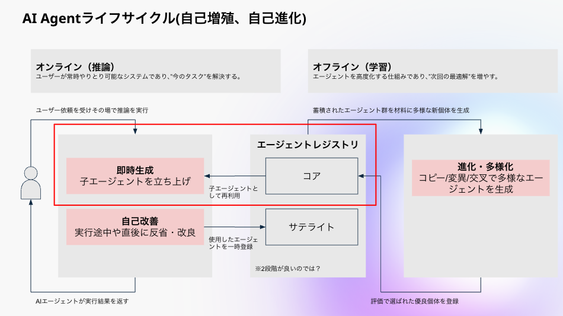
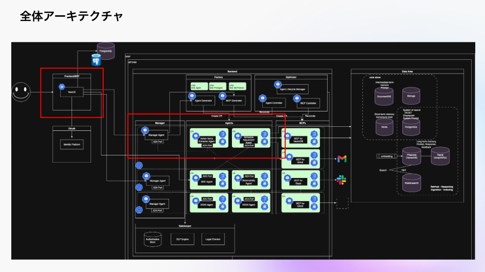

# Omnicore App

omnicore-app は Omnicore を利用した AI Agent の即時生成とエージェントレジストリを提供するプロダクトです

## 概要

- [デモサイト](https://demo-app.bitden.jp/)
- [デモ動画](https://drive.google.com/file/d/1NnkMPo43qP78DqL9deKA3X8qVVWZMkf8/view?usp=drive_link)

> [!WARNING]
> デモサイト、デモ動画は特定の IP からのアクセス、または特定の Google アカウントでのログインが必要です

### 本ソースコードの範囲

本プロダクトは AI Agent ライフサイクルのうち、画像中赤枠の即時生成とエージェントレジストリの部分を担うデモになります

### アーキテクチャ

本プロダクトは全体アーキテクチャのうち、画像中赤枠の部分を担います。

## 開発者向け

### QuickStart

起動方法、開発方法は各コンポーネントの README.md を参照してください

- [frontend/README.md](frontend/README.md)
- [api/README.md](api/README.md)

### CI/CD

> [!IMPORTANT]
> PR を発行した際/main ブランチにマージした際は CICD が常に Green になることを確認してください

PR を発行したときと、main ブランチに push したときに、GitHub Actions が動作します。

確認項目は以下の 3 点です

- `frontend/`,`api/`共通
  - テストが全て通過すること
  - lint エラーがないこと
- `frontend/`のみ
  - ビルドが成功すること
  - firestore hosting にデプロイされること(削除予定)

`main`ブランチにソースコードがマージされると Image が自動で作成されます。  
バージョンを切り替えて問題なければ、その後 GCP のターミナル上から GKE にデプロイしてください。

### AI Coding

Cline、Github Copilot、Claude Code を利用して開発することを想定しており、Agent が E2E で修正をしやすいように、本リポジトリはモノレポ構成になっています。

インストラクションは[AGENTS.md](https://agents.md/)を用いて管理しています。インストラクションを修正する場合は、各フォルダの`AGENTS.md`を修正してください。

> [!IMPORTANT]
> インストラクションを更新するときは、`AGENTS.md`を更新してください。
> `.clinerules/`や各フォルダの`CLAUDE.md`は、`AGENTS.md`に対するシンボリックリンクで同期されているため、更新しないでください。
