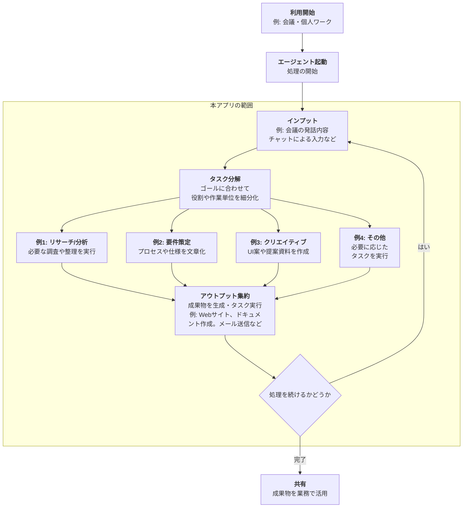
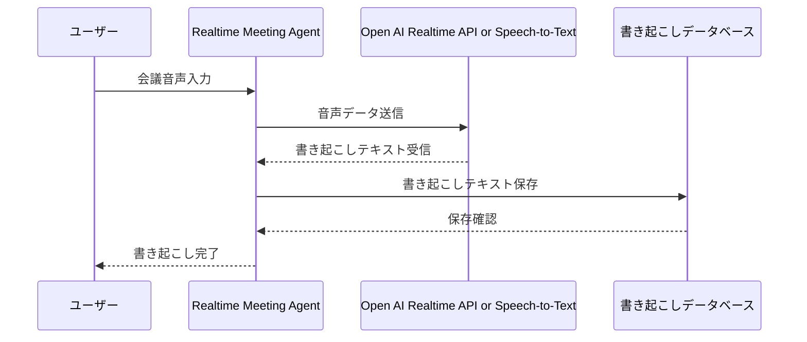
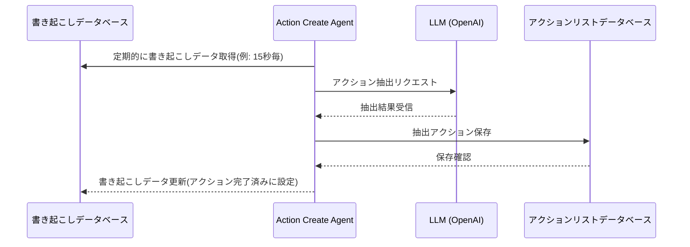
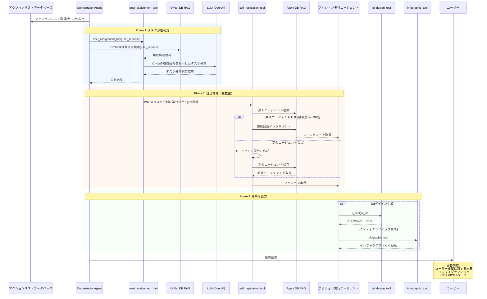
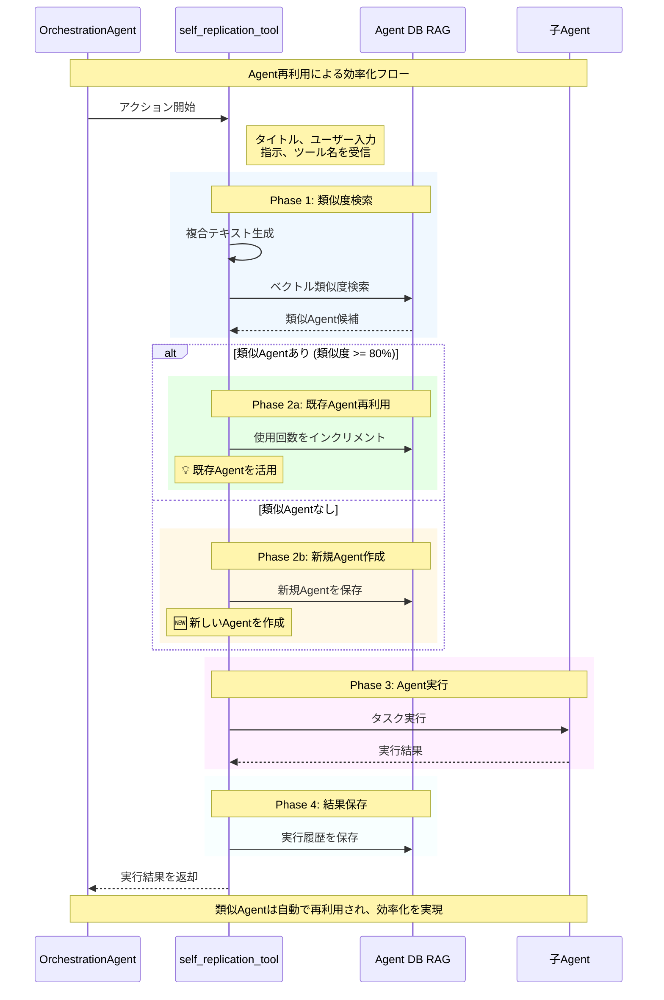

# Omnicore App

[](https://github.com/omnicore2000/omnicore-app/actions/workflows/frontend-test.yaml)
[](https://github.com/omnicore2000/omnicore-app/actions/workflows/api-format.yaml)
[](https://github.com/omnicore2000/omnicore-app/actions/workflows/api-tests.yml)
[](https://github.com/omnicore2000/omnicore-app/actions/workflows/db-migration-check.yml)

omnicore-app は AI Agent の自己増殖の技術とそのユースケースを提供するプロダクトです

- [デモサイト](https://omnicore.bitden.jp/)


> [!WARNING]
> デモサイトは Google アカウントでのログインが必要です。

## 利用フロー

会議や商談のような会話が発生する場面で、本アプリを常時起動する状態で利用します。会議の音声や議事録などの入力した情報を元に、タスク分解とエージェントの自己増殖を行い、成果物を得ることができます。

全体の利用フローは以下の通りです。



## エージェント

本プロダクトでは、以下の 3 種類のエージェントが実装されています。

### 1. リアルタイムミーティングエージェント: `api/src/core/realtime_meeting_agent`

リアルタイムミーティングエージェントは、会議の音声入力を書き起こし DB に保存します。

#### シーケンス



OpenAI の Realtime API または他の Speech-to-Text サービスを利用して、会議の音声をリアルタイムでテキストに変換し、データベースに保存します。

### 2. アクションエージェント: `api/src/core/action_create_agent`

アクションエージェントは、ユーザーからの入力をもとにタスクを分解し、適切なエージェントを生成・実行します。以下のタスクを実現できます

#### シーケンス



### 3. オーケストレーションエージェント: `api/src/core/orchestration_agent`

アクションリストデータベースの内容をタスクに分解し、自動でエージェントを生成します。以下のタスクを実現できます。オーケストレーションエージェントの実装は[`api/src/core/orchestration_agent/agent.py`](api/src/core/orchestration_agent/agent.py)を参照してください。

#### シーケンス



#### OrchestrationAgent の構成要素

アクション作成 Agent が分割したアクションの内容を確認し、O\*Net を利用した適切なタスク分解、Agent DB RAG を利用した類似度検索を経て、エージェントの自己増殖、最適化を行いアクション実行します。

最終的に、情報をまとめたインフォグラフィックまたは、Web のデモページを生成します。

##### self_replication_tool: 自己増殖

本プロジェクトのコアコンポーネントである `self_replication_tool` は、OrchestrationAgent 内で動作し、類似エージェントの再利用と新規エージェントの作成を効率的に行います。

**self_replication_tool の類似エージェント再利用フロー**

self_replication_tool は、既存の類似したエージェントを再利用することで、効率的なエージェント管理を実現しています。



**主要な機能:**

1. **類似度検索**

   - タイトル、ユーザー入力、指示、ツール名を組み合わせた複合テキストでベクトル検索
   - 類似度 80%以上で既存 Agent を自動的に再利用
   - よく使われる Agent を優先的に選択

2. **効率的な Agent 管理**

   - 類似タスクを検出すると既存 Agent を活用し、新規作成のオーバーヘッドを削減
   - 使用回数を自動カウントして人気度を追跡
   - 重複する Agent の作成を防止

**技術的な特徴:**

- OpenAI Embeddings API (text-embedding-3-small, 1536 次元)による高精度な類似度判定
- PostgreSQL + pgvector による高速なベクトル検索

##### infographic_tool: インフォグラフィック生成

- OpenAI API を利用してインフォグラフィック HTML を自動生成するツール
- ユーザー入力とプロンプトから、視覚的に理解しやすいインフォグラフィックを作成
- 生成結果はデータベースに保存され、output_url で参照可能

**主要な機能:**

1. **HTML 生成**

   - OpenAI API でインタラクティブな HTML コンテンツを生成
   - 生成された HTML から純粋なコンテンツを抽出

2. **データベース保存**
   - 生成されたインフォグラフィックを infographics テーブルに保存
   - 親エージェント(generated_agents)に出力 URL を自動設定

##### UI デザイン生成ツール: `ui_design_tool`

- v0 API を利用してアプリの UI デザインを自動生成します
- デザインした Web サイトはデモ用にホスティングされ、URL が提供されます

##### 利用しなくなったツール

過去利用していたが、現在は利用していないツールの一覧です。

- task_split_judge_tool: タスク分解判定ツール (現在は onet_assignment_tool に代替)
- workflow_tool: ワークフロー生成ツール (タスク実行の精度向上が見込めないため未統合)

> [!NOTE]　開発者向け
> workflow_tool は実装されていますが、ワークフロー生成の精度が低く、現在 OrchestrationAgent には統合されていません。  
> 実行する場合は `api/src/core/orchestration_agent/agent.py` の tools 配列に`workflow_tool`をインポート・追加してください。

#### 実行方法

##### OrchestrationAgent を対話的に動かす

オーケストレーションエージェントのみ実行する場合は、以下のコマンドを実行してください。実行の際は[api/README.md](api/README.md)を確認し`.env`の設定や python の環境設定をしてください。

```bash
$ cd api
$ uv run python examples/orchestration_agent/run.py
=== OrchestrationAgent インタラクティブモード ===
指示を入力してください (Ctrl+Cで終了)
例: 'シンプルなTODOアプリのデモを作ってください'

> TODOアプリのデモを作りたいです。
reTODOアプリのデモ用UIを作成する職種の分割がうまく取得できませんでした。
本来期待される職種としては「UI/UXデザイナー」「Webフロントエンドエンジニア」などが適切ですが、ONETからは関連性の高いものが抽出できませんでした。

このまま進めることが難しいため、TODOアプリのデモUI作成に必要な要素を明確にするために、直接的に以下のような具体的なタスク分割が考えられます：

1. TODOアプリに必要な基本機能のリサーチ（例: タスク追加・編集・削除、完了マーク機能など）
2. モダンなTODOアプリのUIトレンド調査（ユーザビリティや配色、レイアウト、アクセシビリティなど）

この2つのタスクをベースに、次のアクション(タスクのエージェント定義と実行)を進めてよろしいでしょうか？ご希望があれば追加要素をご指示ください。


===最終出力===

~~~省略~~~

RunResultStreaming:
- Current agent: Agent(name="OrchestrationAgent", ...)
- Current turn: 7
- Max turns: 10
- Is complete: True
- Final output (str):
    シンプルなTODOアプリのUIデザインが完了しました。以下のリンクからデザインを確認できます。

    [[UI_PREVIEW:シンプルなTODOアプリ|https://XXXX(省略)]]

    デザインは直感的でミニマルなスタイルを維持し、以下の要素を取り入れています。

    1. **直感的なタスク管理**:
       - タスクの追加、削除、完了の管理がワンタッチで行えるインターフェース。

    2. **データの永続性**:
       - ローカルストレージを活用し、ブラウザを閉じてもデータが保持される仕組みを実現。

    3. **通知機能**:
       - Webブラウザを活用した通知機能で、リマインダーを設定可能。

    これにより、ユーザーの操作性を向上させると共に、シンプルで効果的なタスク管理体験を提供しています。
$
```

プロンプトチューニングの際は `api/examples/orchestration_agent/tools/self_replication_tool/instructions` にあるシンボリックリンク経由で self_replication_tool の指示文を編集できます。

##### ActionCreateAgent を対話的に試す

文字起こしデータからアクションを抽出するエージェントを手元で試す場合は、次のサンプルスクリプトを実行してください。[api/README.md](api/README.md) に従い `OPENAI_API_KEY` などの環境変数を設定した上で、対話的に文字起こし本文のみ入力できます（ID は自動生成されます）。

```bash
$ cd api
$ uv run python examples/action_create_agent/run.py
=== ActionCreateAgent インタラクティブモード ===
指示を入力してください (Ctrl+Cで終了)
例: 'TODOアプリのデモを作りたいです。'

> TODOアプリのデモを作りたいです。


===最終出力===
{'has_action': True, 'actions': [{'name': 'TODOアプリのデモを作る', 'context': 'TODOアプリのデモを作りたいです。'}]}
=============

次の入力を待っています...
>
```

## 開発者向け

### 開発を開始する時(Quick Start)

起動方法、開発方法は各コンポーネントの README.md を参照してください

共通

- [全体: README.md](README.md)
- [設計思想: AGENTS.md](AGENTS.md)

フロントエンド

- [全体: frontend/README.md](frontend/README.md)
- [設計思想: frontend/AGENTS.md](frontend/AGENTS.md)

バックエンドと Agent

- [全体: api/README.md](api/README.md)
- [設計思想: api/AGENTS.md](api/AGENTS.md)

### 技術仕様ドキュメント

詳細な技術仕様は以下を参照してください:

**データベース設計:**

- [ワークフロースキーマ設計](docs/db/schema.md) - ワークフロー永続化のための DB 設計
- [ワークフロー永続化 API 仕様](docs/db/workflow-persistence-api-spec.md) - ワークフロー API 実装仕様

**機能仕様:**

- [職種選定ロジック(O\*NET 連携)](docs/onet/spec_job-search.md) - O\*NET を用いた職種検索機能

**開発ツール:**

- [GitHub Copilot 開発手順](.github/copilot-instructions.md) - GitHub Copilot 向け開発ガイド

### タスク管理ツールとの連携

> [!TIP] 開発者向け
> 本章の設定を入れることで、ブランチを作成する時に vscode のタスクで`Notion: タスク作成 (自動採番IDでブランチ作成)`を実行すると、Notion のタスクデータベースに新しいタスクが作成され、そのタスク ID を元にしたブランチが自動で作成されます。
> それにより、タスク管理とコード管理の連携がスムーズになります。

プロジェクトルートに `.env` ファイルを作成し、[Notion](https://www.notion.so/2566ac7ccc5480c9b965f6a89ae5a6d5?source=copy_link)から値を参照し、以下の環境変数を設定してください：

```bash
# Notion連携（VSCodeタスク作成機能で使用）
NOTION_API_TOKEN=your_notion_api_token_here
NOTION_DATABASE_ID=your_notion_database_id_here
GIT_MAIN_BRANCH=main  # オプション（デフォルト: main）
```

### CI/CD

PR の発行、main ブランチへのマージ時に CI の実行、main ブランチへのマージ時に GKE へのデプロイが行われます。

#### CI: PR 発行、main ブランチへのマージ時

> [!IMPORTANT] 開発者向け
> PR を発行した際/main ブランチにマージした際は CICD が常に Green になることを確認してください

PR を発行したときと、main ブランチに push したときに、GitHub Actions が動作します。

確認項目は以下の通りです。

- `frontend/`,`api/`共通
  - テストが全て通過すること
  - lint エラーがないこと
- `frontend/`のみ
  - ビルドが成功すること

#### CD: main ブランチへのマージ時

`main`ブランチにソースコードがマージされると GKE に自動でデプロイされます。

> [!TIP] 開発者向け
> 環境変数の追加や新規コンポーネントを追加した時は、GCP の画面から手動で設定を追加してください。

#### リリース管理

##### リリースタグの命名規則

- 形式: `YYYY.MM.DD` (例: `2025.08.29`)
- 年月日をドット区切りで表記

##### リリース手順

1. `main` ブランチで開発完了後、適切なタグを作成
   ```bash
   git tag 2025.09.27
   git push origin 2025.09.27
   ```
2. GitHub の Releases 機能を使用してリリースを作成
3. リリース名は `[YYYYMMDD]説明` の形式 (例: `[20250829]第1回競技会デモ`)
4. 各リリースには変更内容の詳細を記載

##### 自動デプロイ

- `main` ブランチへのマージ時に GKE へ自動デプロイ
- リリースタグ作成時にもデプロイが実行される

### 推奨 VSCode 拡張機能

このプロジェクトでは以下の VSCode 拡張機能を推奨しています。`.vscode/extensions.json` で設定済みのため、VSCode で開いた際に自動的にインストールが推奨されます。

- **Claude Code** (`Anthropic.claude-dev`): Anthropic の公式 Claude コード支援拡張機能
- **GitHub Copilot** (`GitHub.copilot`): AI ペアプログラミング支援
- **Cline** (`saoudrizwan.claude-dev`): Claude 統合開発支援ツール

> [!TIP] 開発者向け
> VSCode で初回プロジェクトを開いた際、右下に拡張機能のインストール推奨通知が表示されます。「Install All」をクリックすると一括インストールできます。

### AI Coding

AI Coding ツールを利用して開発することを想定しており、Agent が E2E で修正をしやすいように、本リポジトリはモノレポ構成になっています。

#### 利用している AI Coding ツール

利用している AI Coding ツールは以下の通りです

| ツール名                                              | 用途                                       | 動作環境        |
| ----------------------------------------------------- | ------------------------------------------ | --------------- |
| [Claude Code](https://claude.ai/code)                 | Anthropic の公式 AI コーディング支援ツール | VSCode / Github |
| [GitHub Copilot](https://github.com/features/copilot) | GitHub の公式 AI コーディング支援ツール    | VSCode / Github |
| [Cline](https://clinerules.com/)                      | Claude 統合開発支援ツール                  | VSCode          |
| [CodeRabbit](https://coderabbit.ai/)                  | PR 自動レビュー                            | Github          |

上記の推奨拡張機能は、以下の環境で自動的にインストールされます：

- **通常の VSCode**: `.vscode/extensions.json` による推奨設定
- **Dev Container**: `.devcontainer/devcontainer.json` で自動インストール

#### インストラクションの管理: [AGENTS.md](https://agents.md/)

インストラクションは[AGENTS.md](https://agents.md/)を用いて管理しています。インストラクションを修正する場合は、各フォルダの`AGENTS.md`を修正してください。

> [!IMPORTANT] 開発者向け
> インストラクションを更新するときは、`AGENTS.md`を更新してください。
> `.clinerules/`や各フォルダの`CLAUDE.md`は、`AGENTS.md`に対するシンボリックリンクで同期されているため、更新しないでください。

#### CodeRabbit の PR レビュー

GitHub 上で PR を発行した時、Code Rabbit による自動レビューが実行されます。レビュー内容を確認し、必要に応じて修正してください。

#### ClaudeCode による PR / ISSUE に対するコメント

Github 上で `@claude`とメンションをつけてコメントすると、Claude Code がコメント内容に応じたコード修正案を提示します。
例えば、`@claude この関数をリファクタリングしてください`とコメントすると、Claude Code がリファクタリング案を提示します。

お試し用の ISSUE を用意しています。以下のリンクからアクセスしてください。

- [ISSUE #1: Claude code のテスト用の ISSUE](https://github.com/omnicore2000/omnicore-app/issues/33)
